# Piezo input circuit

I am no electrical engineer. And even further from an analog electrical engineer. But I do find this subject very interesting. That is also why I want to start with this part, and make it as simple as possible.

> The word piezo is [derived](https://en.wikipedia.org/wiki/Piezo) from the greek word πιέζω which means to 'squeeze' or 'press'.

## Piezo basics

A piezo disc is mainly a ceremic disc on a metal base disc. By deforming on the disk, a voltage is generated.

It is said that an aggressive hit on a piezo can generelated tens of volts (but at a low power). Nevertheles, the final circuit needs some protection against spikes.

Another thing that may need to be taken into account for the circuit is to hold the peak for a but (using a capacitor). This way the microcontroller might have an easier time detecting the signal.

## Alesis DM6 rubber pads

To see what a (budget) e-drum pad looks like on the inside I opened a pad from the [Alesis DM6](https://www.e-drumstel.nl/discontinued-drums/alesis-dm6/) kit.

Going from top-left to bottom-right. First I removed the plastic ring and rubber top layer. This reveales a foam plate. Under this foam plate is a glass disc under which a piezo disk is mounted. The ceremic part is pointing to the ground when the pad is mounted normally to the kit. The PCB for the connector contains two resistors and are connected as shown. This is just a voltage divider. Here "Tip" and "Sleeve" refer to the 1/4" jack.

  

    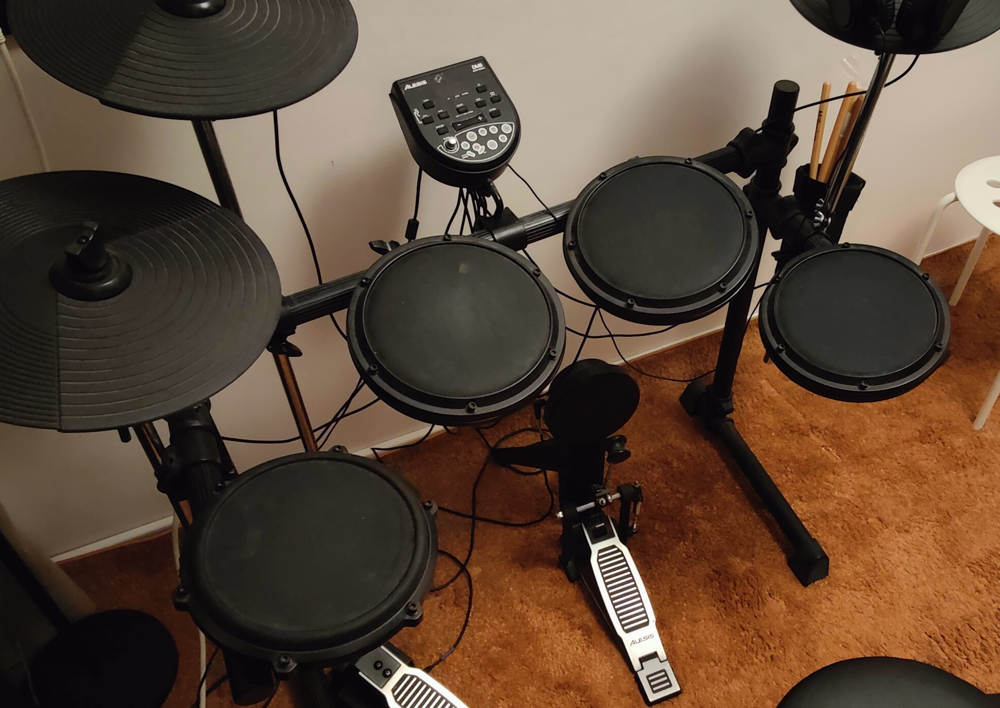
    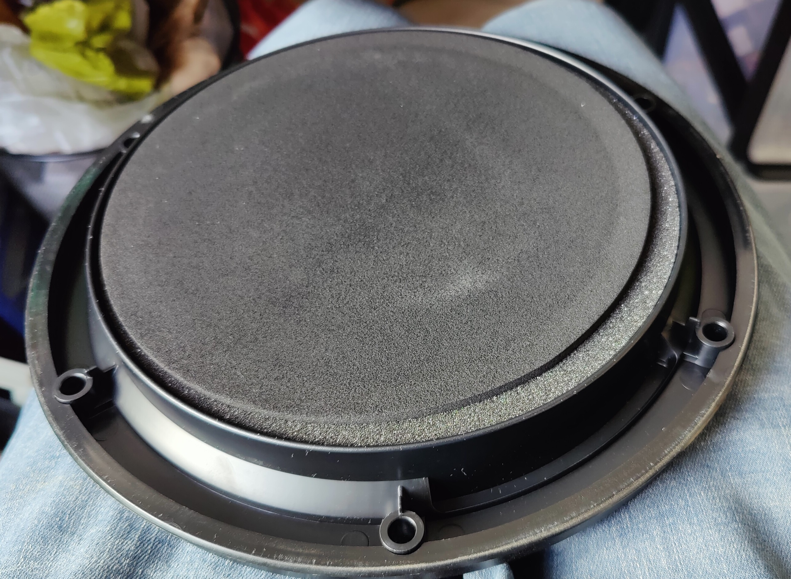
    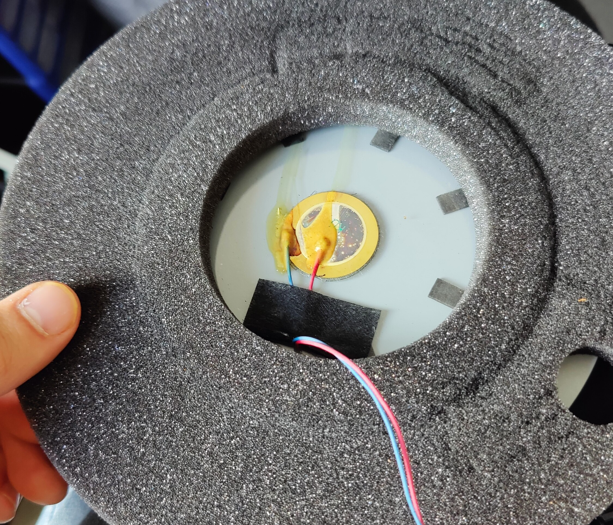
  

  

    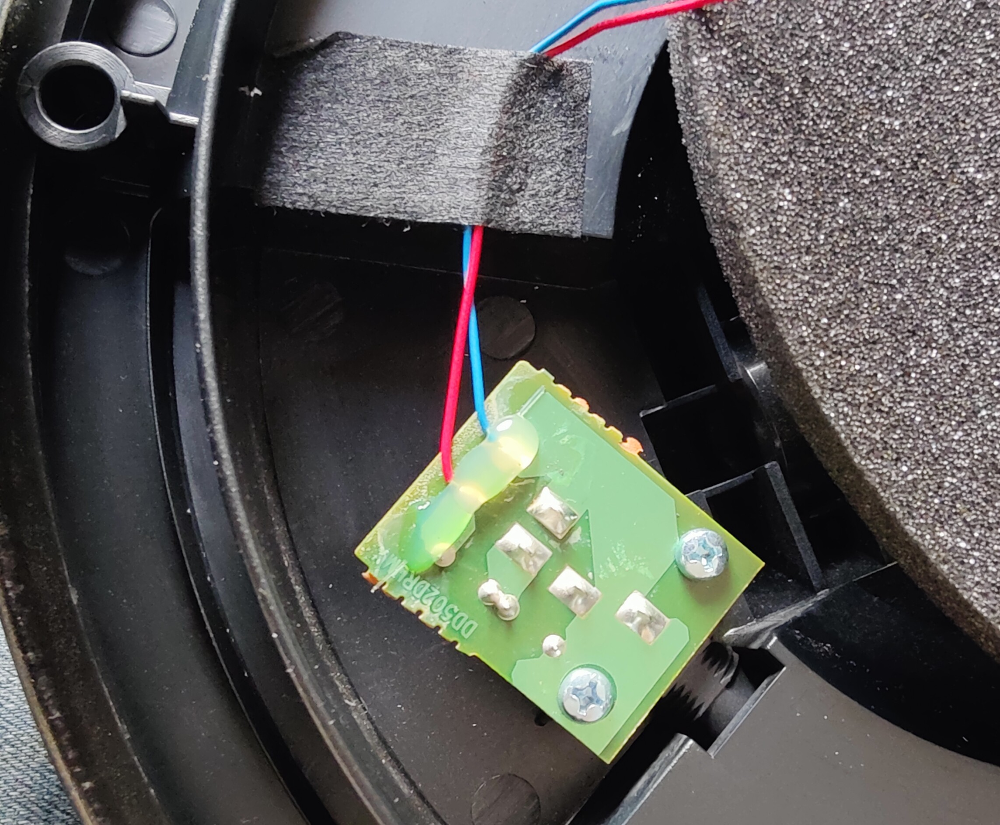
    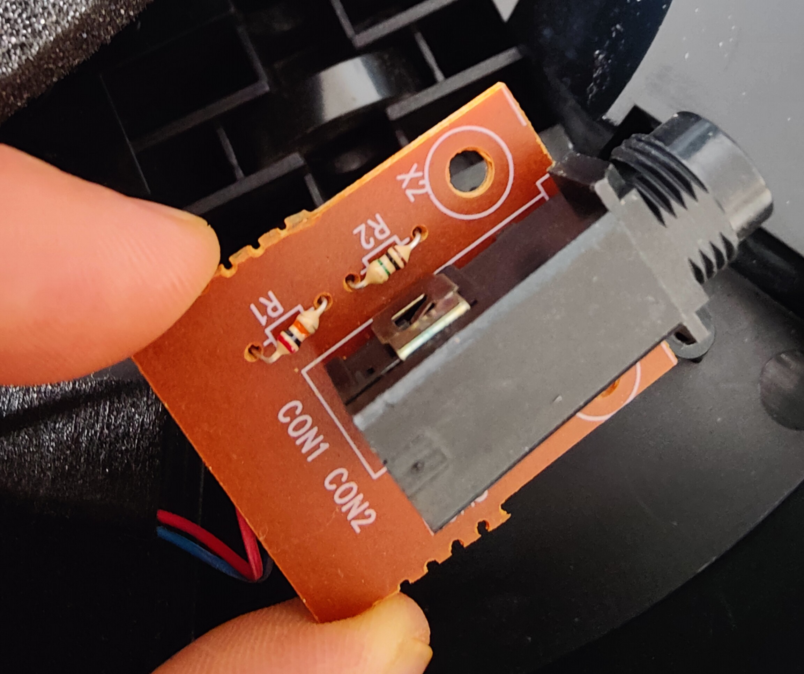
    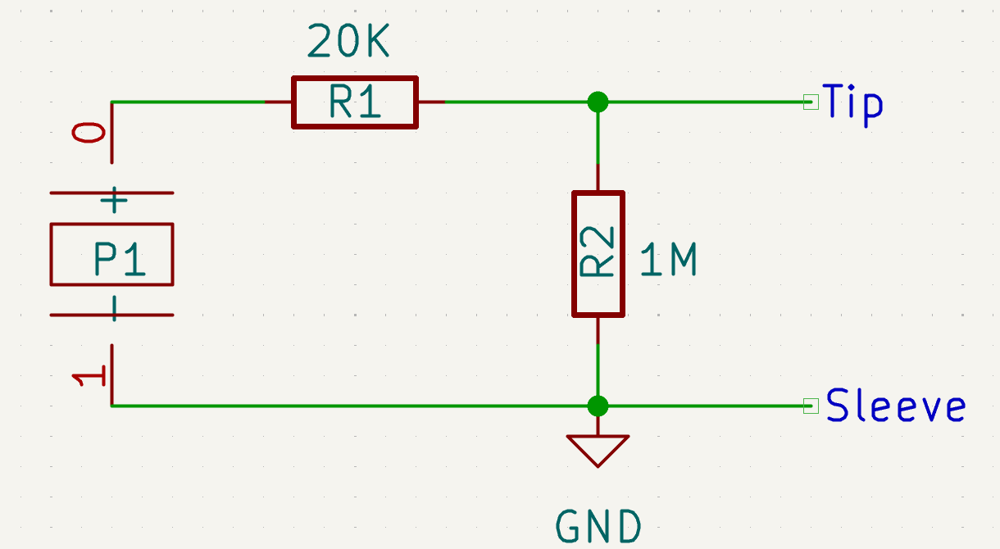
  

I found similar circuits for other pads when looking online.

## Pad side of the circuit

So the circuit inside a pad is voltage divider and the output is the voltage over R2. By using a potentiometer instead, and connecting the tip to the 'middle' of the potentiometer, each pad can be finetuned.

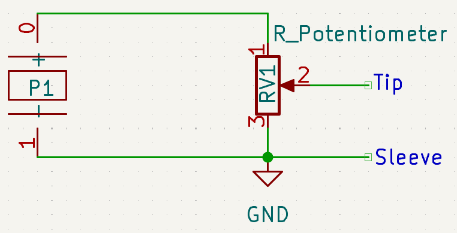

### Bare piezo signal

Before going further I want to have a more detailed look at the raw piezo signal.

> When looking at the scope images, pay attention to the time and voltage division values!

First I connected the scope probe straight to the ceremic part of the piezo disc, and the ground to the base disc. The scope shows the signals after I hit the disc with my finger. I also looked at the idle signal of the piezo in the different circuits. In this 'open' circuit I noticed that the center of the idle signal was not really at ground.

  

    
  

  

    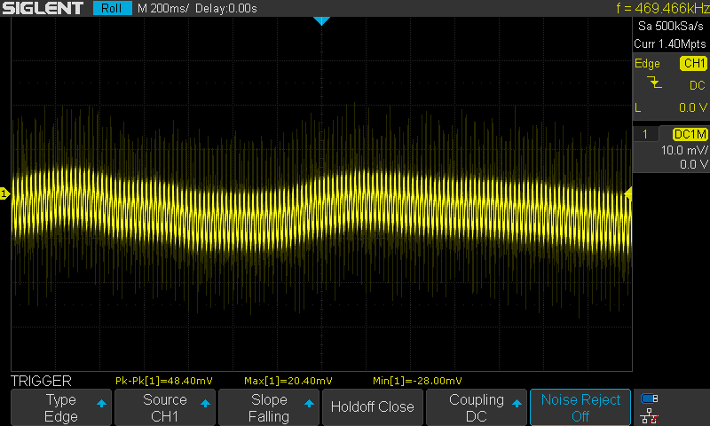
    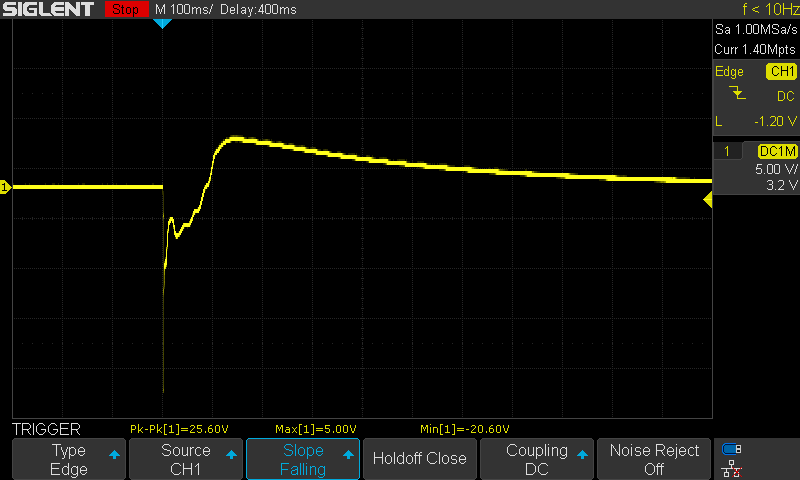
  

Then I places a 1M ohm resistor in parall with the piezo. Once the parallel resistor was connected the center of the idle signal was already more stable around ground.

The maximum (positive) voltage didn't really change. But the signal went a lot quicker ban to ground. Now it went back (after hitting it) after ~300ms. In the previous circuit that was ~1100ms.

  

    
  

  

    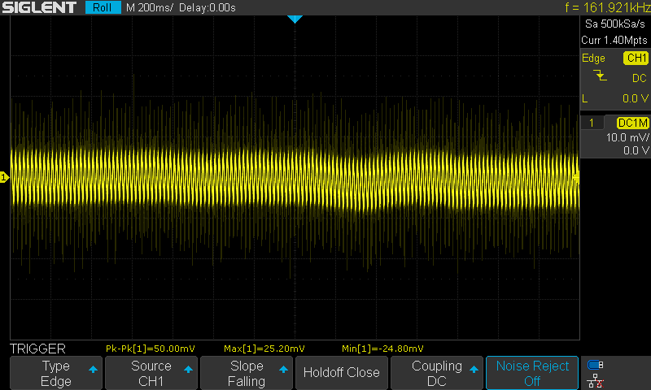
    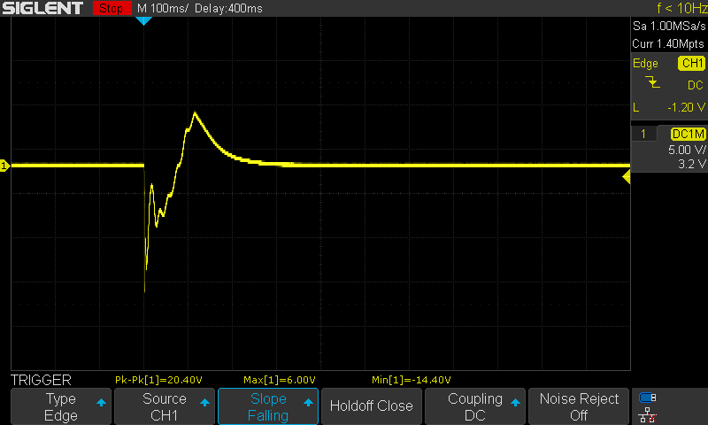
  

Then I made a voltage divider with a 22K ohm resistor connected to the 'positive' wire of the piezo. We are measuring the voltage over the parallel 1M ohm resistor.

This time the signal went back to ground after ~200ms

  

    
  

  

    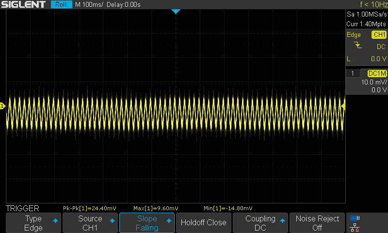
    
  

### Drum pad piezo signal

The same was done with with Alesis drum pad, and my own DIY drum pad (created based on the [open-e-drum project](https://open-e-drums.com/hardware/download_pad.html)). For the DIY pad I used the same circuit (voltage divider) as the Alesis pad. However, instead of a 20K ohm resister I used a 22K ohm resister since that was the closest value I had.

All scope images of a hit where made by hitting the center of the pad with a drum stick.

Testing the Alesis 8 inch pad.

  

    
  

  

    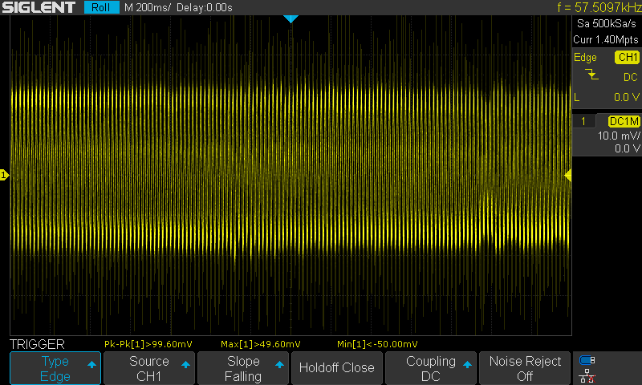
    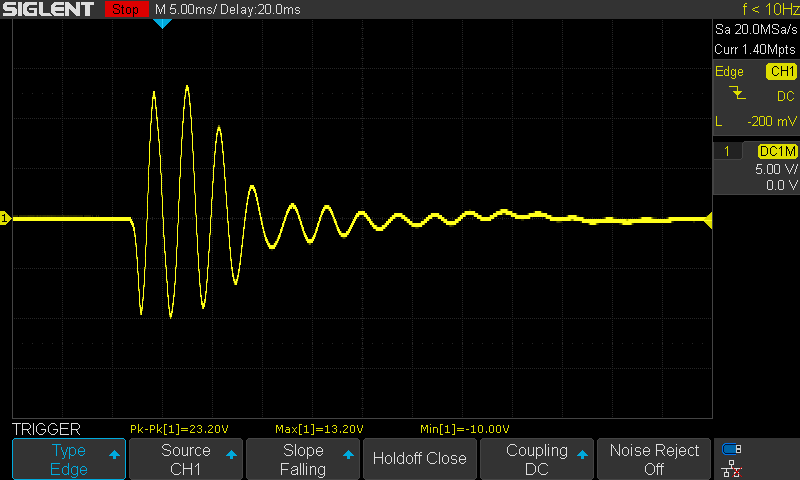
  

The DIY pads have the construction shown below. The piezo (base) disk is 35mm in diameter.

  

    
    
    
  

Looking at the signals from the DIY pads the following things stand out:

- The signal takes a lot longer to die out. This may be changes by changing the tightness of the mesh head. But probably the hit of a stick also resonates more into the 3D printed shell, which then is transferred to the piezo.
- The signals is not a smooth decaying sine wave. Instead you see that there are small 'dents' in the high and low part of the signal. This probably has to do with the DIY nature of mount ing the piezo between two double-sided pieces of tape, and the sub-optimal DIY foam coan.
- The amplitude of the Alisis pad is almost twise as large as that one of the DIY pads. Maybe because it is a different piezo.

Nevertheless, the DIY pads do work like a normal pad when connecting it to the Alesis DM6 module. The volume was a little bit lower than the original pads. But, in my experience, not twice as lower.

Testing the DIY 8 inch pad.

  

    
  

  

    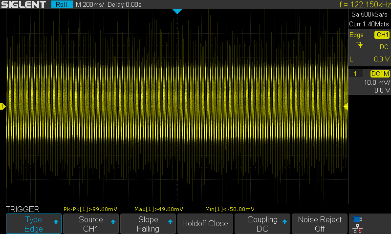
    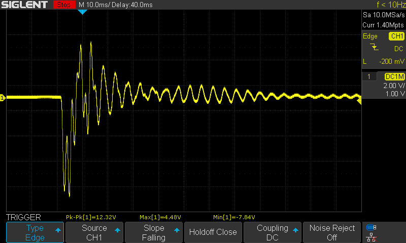
  

Testing the DIY 10 inch pad.

  

    
  

  

    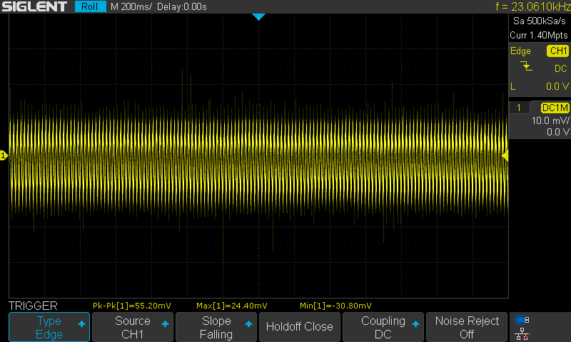
    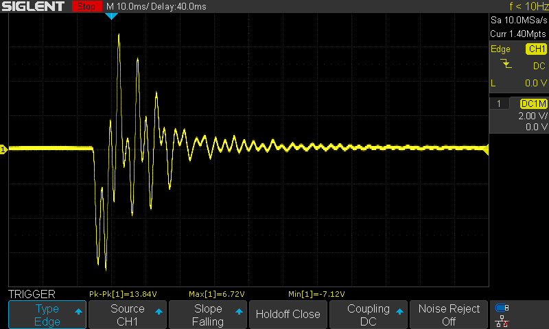
  

## Module side of the circuit

From the previous measurement it was seen that the input amplitude can be on quite a large range (from ~4V amplitude to ~14V amplitude). Also some people may hit hard and others soft. You also want to have some dynamics while playing which impact the voltage.

The excact type of wave and voltage amplitude depends on the piezo itself and its surroundings. To not pin myself on a certain setup (and to make it easier for myself) I just want to make sure that the negative part of clipped to 0V, and that the positive part is clipped to the maximum allowed voltage of the chosen microcontroller.

To still have some room for dynamic playing, the input voltage must be manually adjustable. Otherwise, if the circuit would simply clip the input to for example 3.3V, there would be no room for dynamic playing. Everthing would not clip.

For example I placed a zener diode of 3.3V (1n4728a) and 7.5V (1n4737a) parallel to the piezo input. The results are shown below.

  

    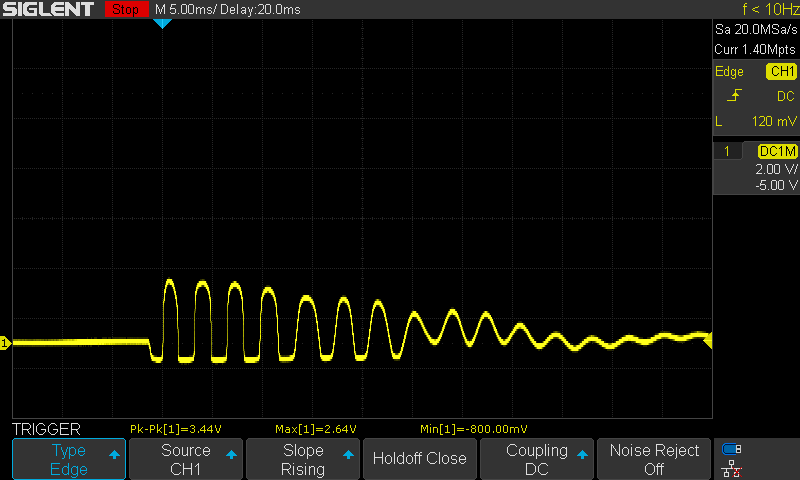
    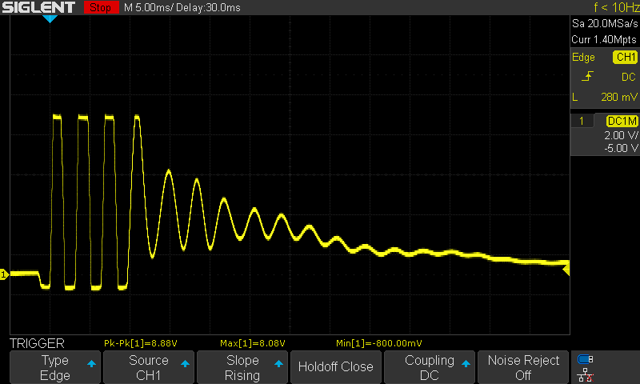
  

I also want to add an RC circuit to control how long the peaks can be read out.

The R and C form the RC circuit. The zener diode clips the positive part of the input signal to the zener voltage. The 'normal' diode makes sure voltage drop over the zener diode in the negative part of the input signal is blocked. Preventing negative inputs to the ADC of the microcontroller. The downside of this circuit is that the voltage to the ADC always has the voltage drop over D1. To prevent this, a [peak detector circuit](https://components101.com/articles/peak-detector-circuit-type-working-explanation-using-opamp) could be added.

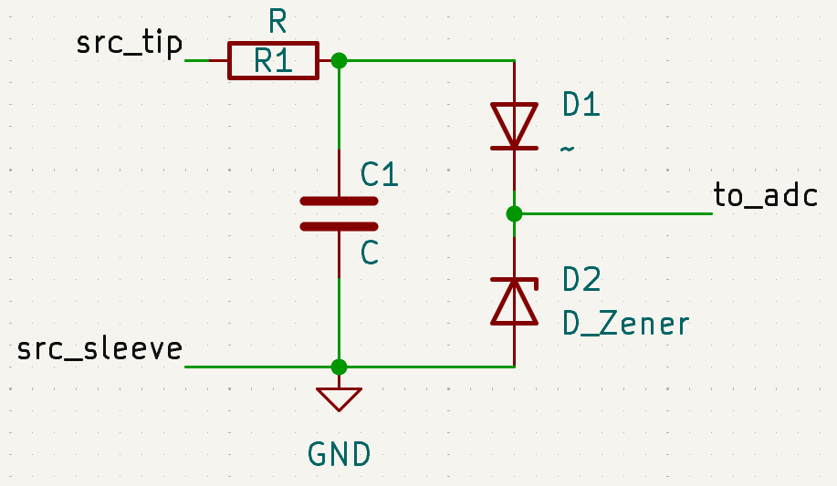

In the [fallstad circuit](https://www.falstad.com/circuit/circuitjs.html?ctz=CQAgjCAMB0l3BWcMBMcUHYMGZIA4UA2ATmIxAUgpABZsKBTAWjDACgBDEJlGqsFHm5hC-QSGISoyeHG4x42MAgw1C2JTTyRsKYgkLds0ZRgJ9CrbJUKGwsyGwBu3GiJC8qTN3YHSIfMjSVDAIbABOru6sKNyYsTH+8BFxGAl+PGkegfzJkSx+YBiGBbGe0mhwbADuqWWBLOLljrXe7uWZ9SFsAA4guuDiA+X0ITIOveDFIIQ0U4YoBv3B47I13LPgGdrzUOvDDQJCzetFhpudM3MtdVe3iTdnHkuXi4Y3ry-x2d2tiUfCaZgYixD5PYGxHiBCF7VrlGFQ-g0a5sAAmwlEgyEpSxHhAqIYADMOABXAA2ABd1pdEoitqCUjiAUzplRKI4uExNgDouJJMZRqs5DxoKQUCI+MQ8NhiNgaCpmNiFHAlCo1BowFodHolvY1rVeUIBgDHnZxCw7KzqdFply5k8PtzbdzkbDhIVbTsHWwAPYgcibMR6KgCyAiVRhtTEZEIYjvWBwCD8X0gISBwbB2ii0gYdkCGikbCshNh8DgNhAA) the AC signal has an amplitude of 10V. The first opamp has voltage range 0v to 9v. The second opamp has voltage range of 0v to 3.3v.
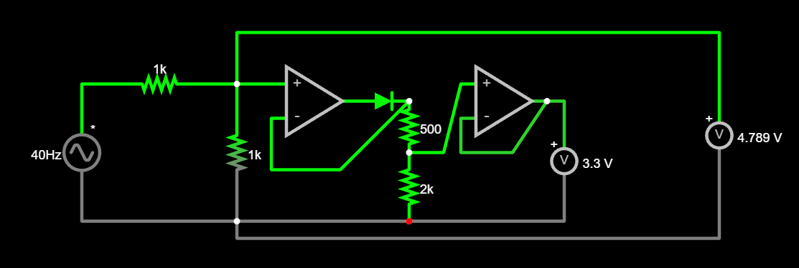

The first opamp is a voltage follower. This makes sure that the high impedence piezo doesn't interfere with the circuit in the module.

In falstad this circuit looked fine. But when building it, the diode after the first opamp gave some issues on the negative cyle of the piezo voltage. The opamp would clip to Vcc (20V). So I added a diode between the two piezo signals to ignore the negative cycle. The screenshot below shows that the lower voltages result in a 0V output from the opamp.

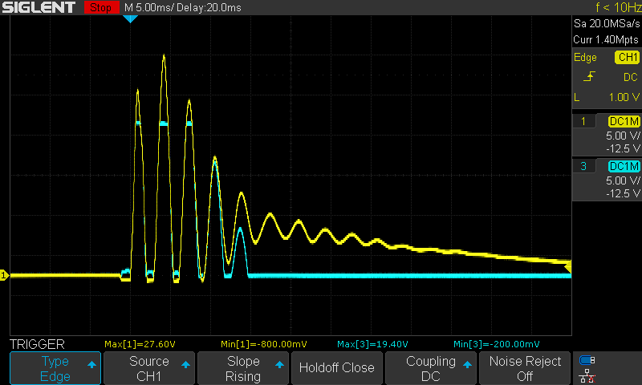

After to trying things, I figured that the voltage drop over the output diode might be the issue. Removing this output diode and connecting the output straight into the negative opamp input, the piezo voltage was followed correctly at the lower voltages as well.

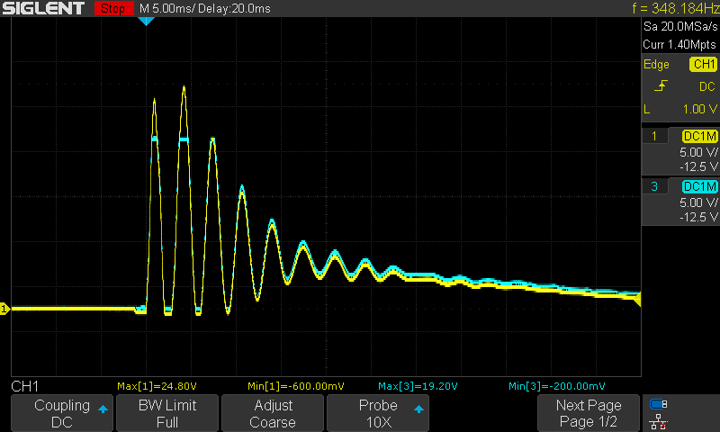

Once that worked. I added a potentiometer between output of the first opamp and the input of the second opamp to control the output voltage. I also increased Vcc to 30V. The two images below show different amount of rotation of the potentiometer. Blue is the output if the first opamp. Purple is the output of the second opamp.

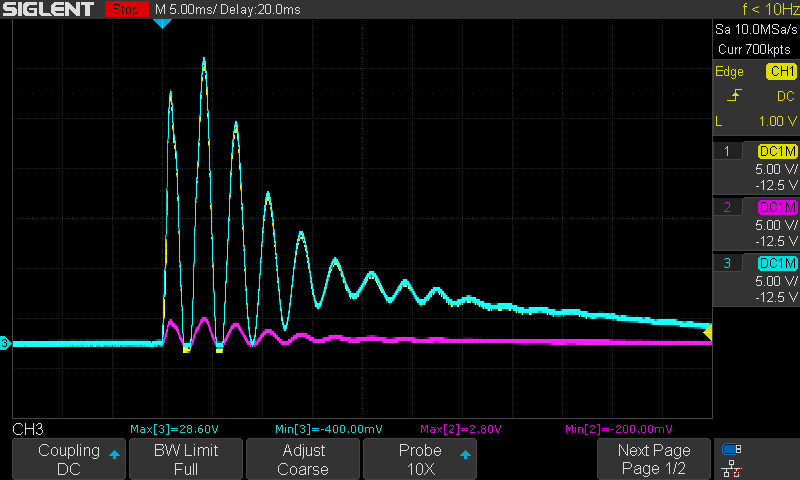

The second opamp is there to clip the output voltage to the maximum allowed input voltage of the ADC. In the images above a single Vcc was used. Later on I will try separate Vcc voltages to check the clipping of the opamp.

In the meantime I tries a zener on the output of the second opamp. However, either the zener is not the best, or I don't understand zeners enough. But the 3V zener still resulted in voltages larger than 3V. The voltage was clipped like a zener, however.

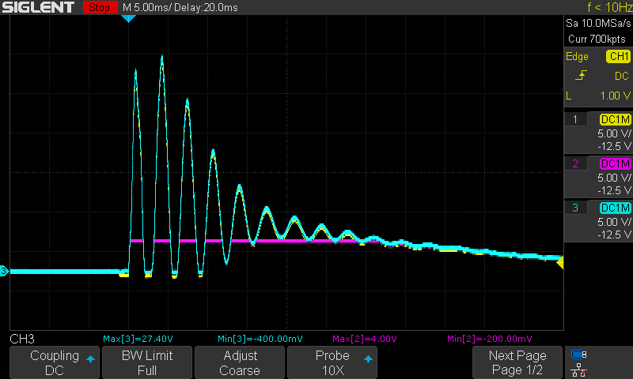

Optionally a second potentiometer can be added between the output of the second opamp and the negative input of the second input. Where the 'negative' of the opamp is connected to ground. This allows to boost low voltage signals from the piezo. But seeing the voltages created by a drum pad, I don't think that this is necessary.

The final circuit (without the final boost potentionmeter and the RC holding circuit) looks like this.

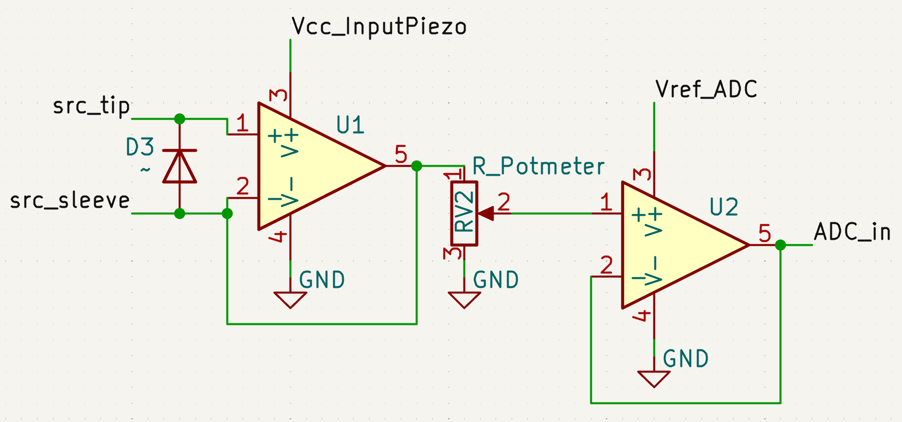
