# Piezo input circuit

I am no electrical engineer. And even further from an analog electrical engineer. But I do find this subject very interesting. That is also why I want to start with this part, and make it as simple as possible.

> The word piezo is [derived](https://en.wikipedia.org/wiki/Piezo) from the greek word πιέζω which means to 'squeeze' or 'press'.

## Piezo basics

A piezo disc is mainly a ceremic disc on a metal base disc. By deforming on the disk, a voltage is generated.

It is said that an aggressive hit on a piezo can generelated tens of volts (but at a low power). Nevertheles, the final circuit needs some protection against spikes.

Another thing that may need to be taken into account for the circuit is to hold the peak for a but (using a capacitor). This way the microcontroller might have an easier time detecting the signal.

## Alesis DM6 rubber pads

To see what a (budget) e-drum pad looks like on the inside I opened a pad from the [Alesis DM6](https://www.e-drumstel.nl/discontinued-drums/alesis-dm6/) kit.

Going from top-left to bottom-right. First I removed the plastic ring and rubber top layer. This reveales a foam plate. Under this foam plate is a glass disc under which a piezo disk is mounted. The ceremic part is pointing to the ground when the pad is mounted normally to the kit. The PCB for the connector contains two resistors and are connected as shown. This is just a voltage divider. Here "Tip" and "Sleeve" refer to the 1/4" jack.

  

    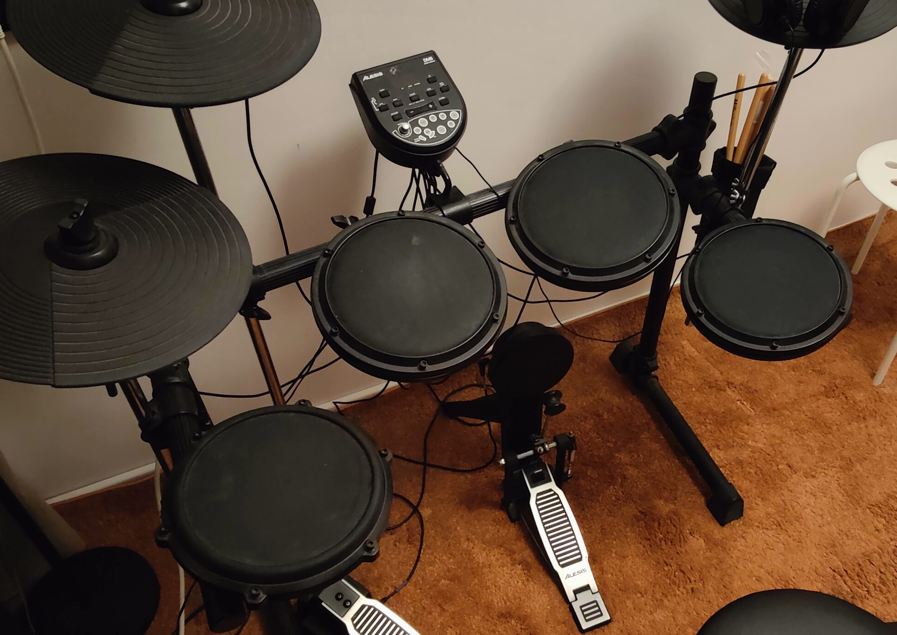
    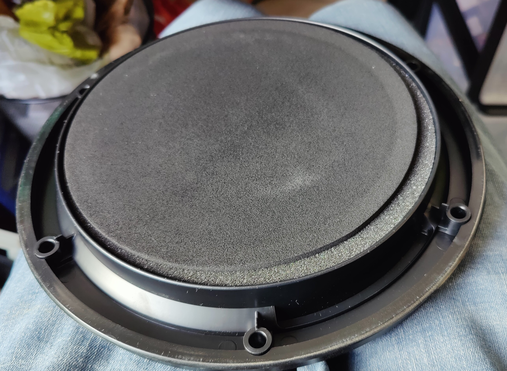
    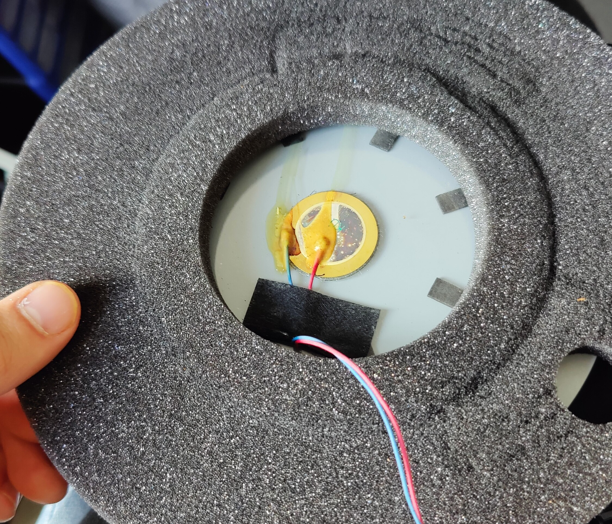
  

  

    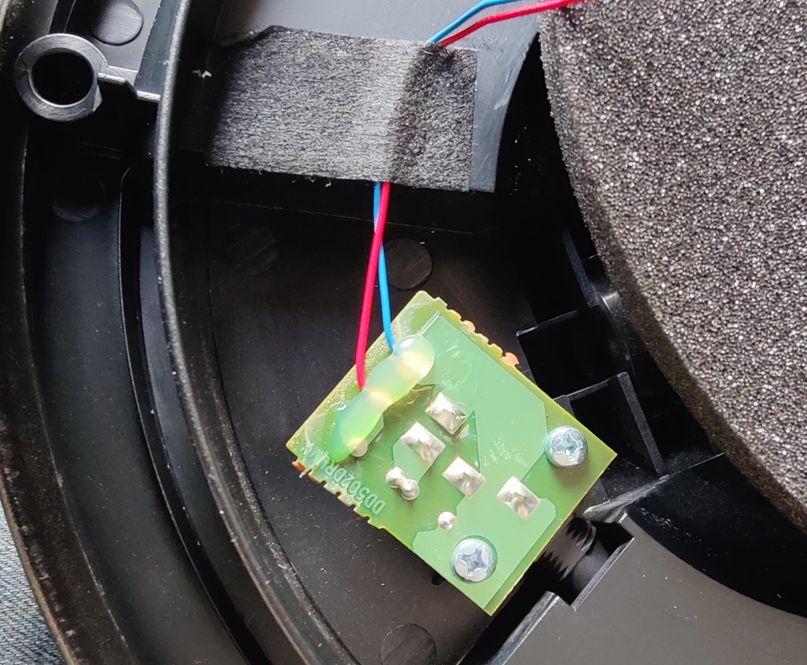
    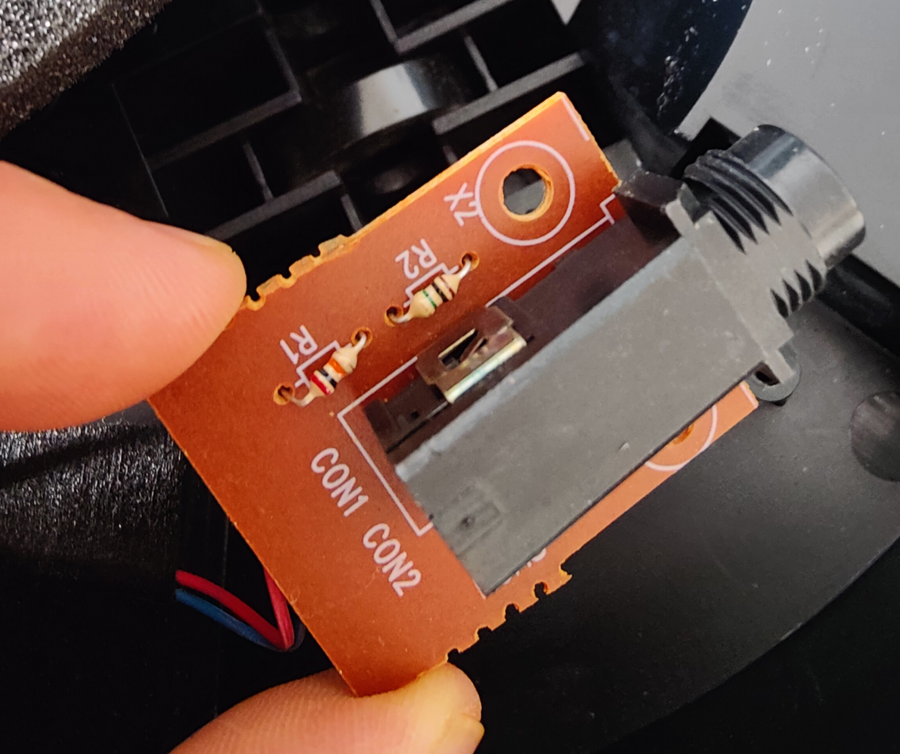
    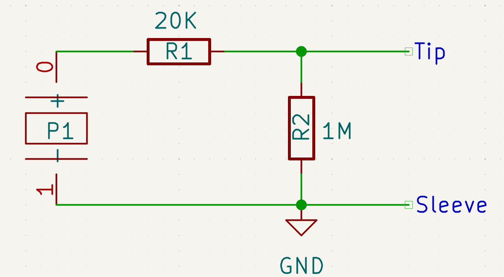
  

I found similar circuits for other pads when looking online.

So the circuit inside a pad is voltage divider and the output is the voltage over R2. By using a potentiometer instead, and connecting the tip to the 'middle' of the potentiometer, each pad can be finetuned.

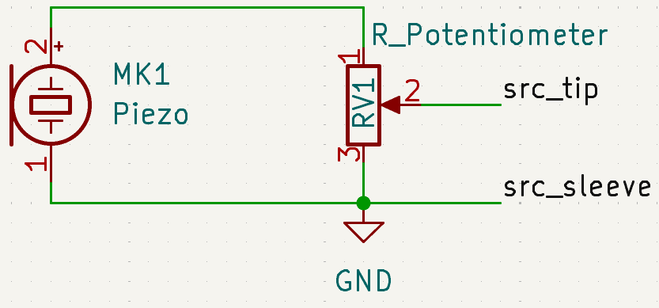

## The raw piezo signal

### Bare piezo signal

Before going further I want to have a more detailed look at the raw piezo signal.

> When looking at the scope images, pay attention to the time and voltage division values!

First I connected the scope probe straight to the ceremic (white) part of the piezo disc, and the ground to the base disc. The scope shows the signals after I hit the disc with my finger. I also looked at the idle signal of the piezo in the different circuits. In this 'open' circuit I noticed that the center of the idle signal was not stable at ground.

  

    
  

  

    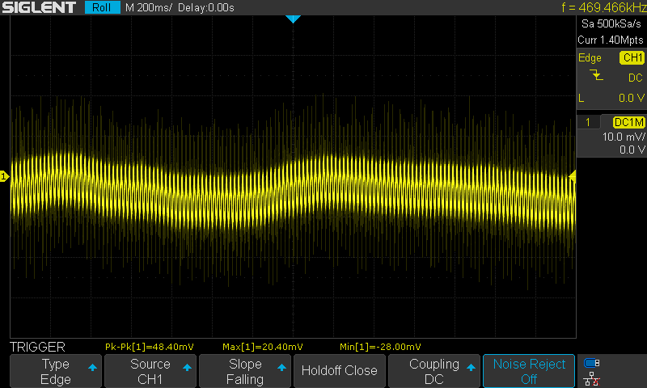
    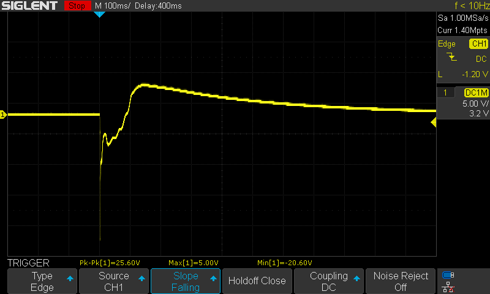
  

### Parallel resistor

Then I placed a 1M ohm resistor in parall with the piezo. Once the parallel resistor was connected the center of the idle signal was already more stable around ground.

The maximum (positive) voltage didn't really change. But the signal went a lot quicker ban to ground. Now it went back (after hitting it) after ~300ms. In the previous circuit that was ~1100ms.

  

    
  

  

    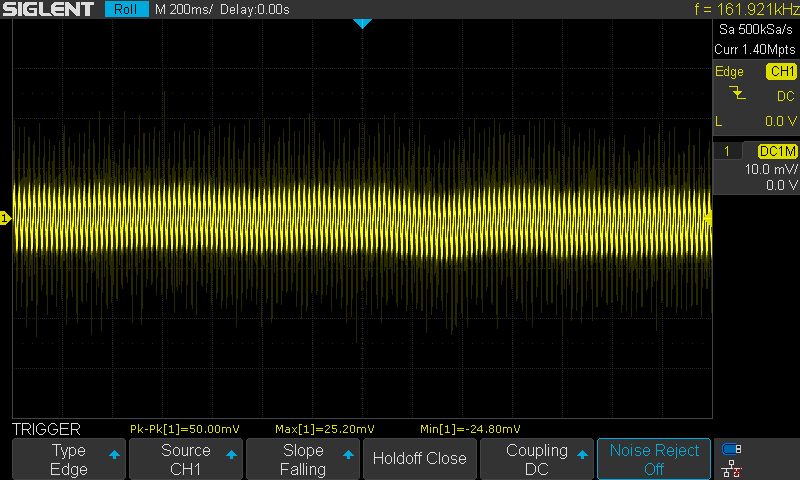
    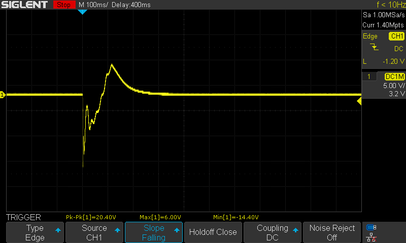
  

### Voltage divider circuit

Then I made a voltage divider with a 22K ohm resistor connected to the 'positive' wire of the piezo. We are measuring the voltage over the parallel 1M ohm resistor.

This time the signal went back to ground after ~200ms

  

    
  

  

    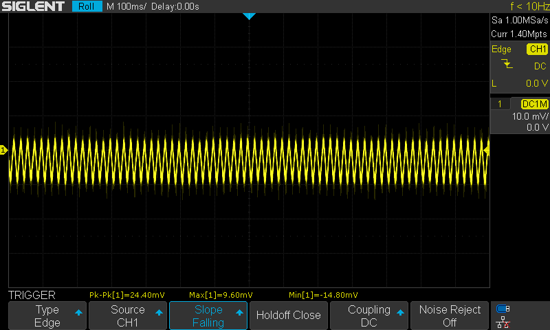
    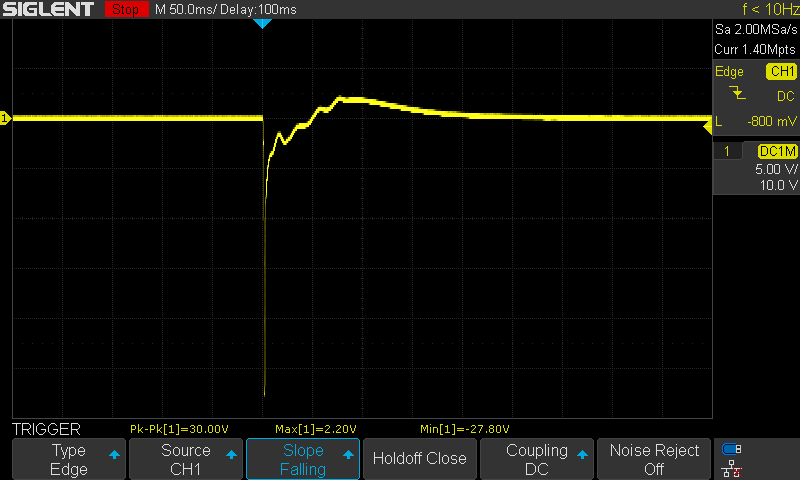
  

### Drum pad piezo signal

The same was done with the Alesis drum pad (8-inch), and my own DIY drum pads (8-inch and 10-inch) (created based on the [open-e-drum project](https://open-e-drums.com/hardware/download_pad.html)). For the DIY pad I used the same circuit (voltage divider) as the Alesis pad. However, instead of a 20K ohm resister I used a 22K ohm resister since that was the closest value I had.

All scope images of a hit where made by hitting the center of the pad with a drum stick.

#### Alesis 8-inch pad

The signal after a hit shows a lot more oscillations than the bare piezo. Most likely because of the other materials in the pad that resonate as well.

The signals has an amplitude of ~13V and goes back to ground after ~40ms.

  

    
  

  

    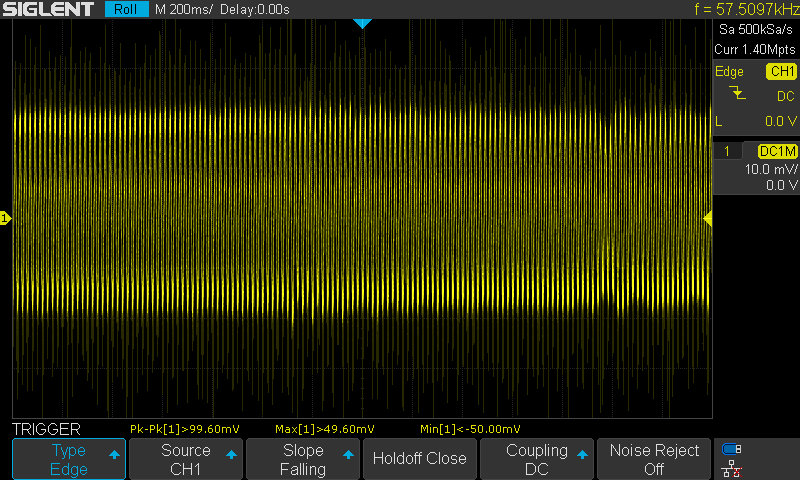
    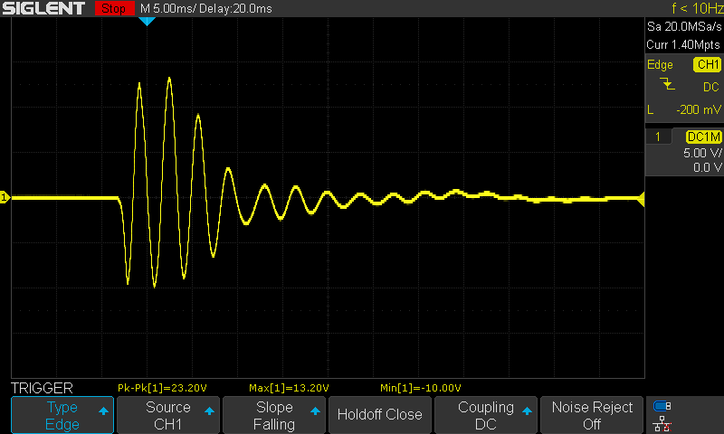
  

#### DIY 8-inch pad

The DIY pads have the construction shown below. The piezo (base) disk is 35mm in diameter.

  

    
    
    
  

Looking at the signals from the DIY pads the following things stand out:

- The signal takes a lot longer to die out (~100ms). This may be changed by changing the tightness of the mesh head. But probably the hit of a stick also resonates more into the 3D printed shell, which then is transferred to the piezo.
- The signals is not a smooth decaying sine wave. Instead you see that there are small 'dents' in the high and low part of the signal. This probably has to do with the DIY nature of mounting the piezo between two double-sided pieces of tape, and the sub-optimal DIY foam coan.
- The amplitude of the Alisis pad ~(13V) is almost twise as large as that one of the DIY pads (~6.5V). Maybe because it is a different piezo, or because the piezo is physically further away from the hit of the stick on the pad.

Nevertheless, the DIY pads do work like a normal pad when connecting it to the Alesis DM6 module. The volume was a little bit lower than the original pads. But, in my experience, not twice as lower. Increasing the volume on the DM6 module a bit solved this 'issue'.

  

    
  

  

    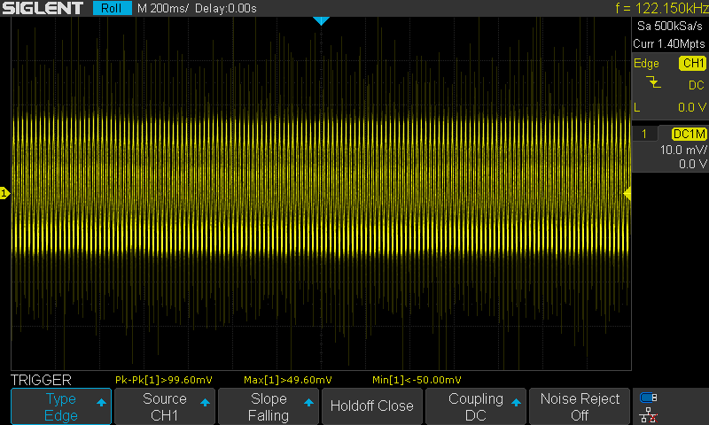
    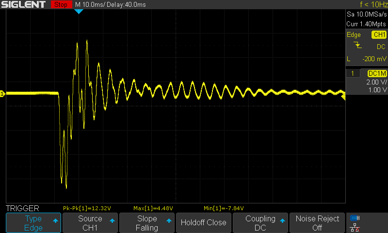
  

#### DIY 10-inch pad

The 10-inch DIY has the same learning points as the 8-inch DIY pad.

  

    
  

  

    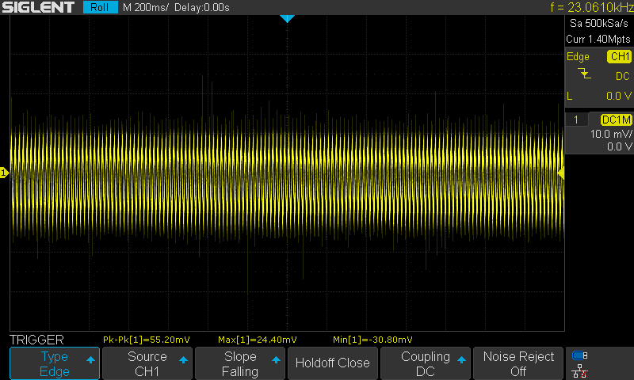
    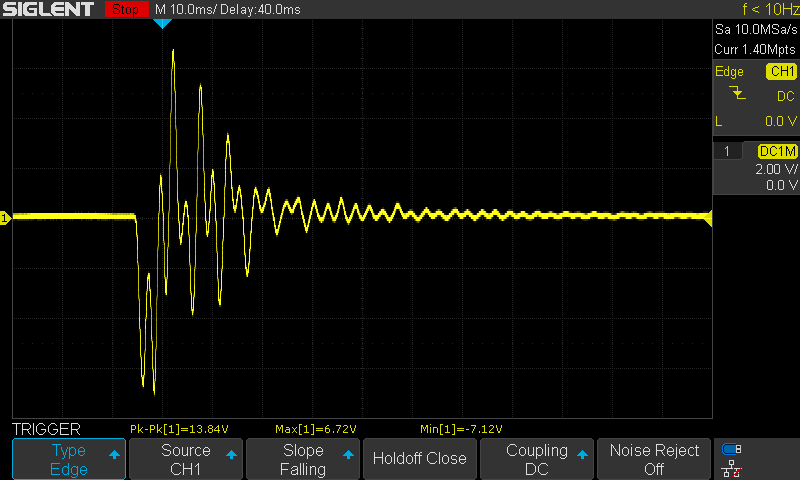
  

## Module side of the circuit

From the previous measurement it was seen that the input amplitude can be on quite a large range (from ~4V amplitude to ~14V amplitude). Also some people may hit hard and others soft. You also want to have some dynamics while playing which impact the voltage.

The excact type of wave and voltage amplitude depends on the piezo itself and its surroundings. To not pin myself on a certain setup (and to make it easier for myself) I just want to make sure that the negative part is clipped to 0V, and that the positive part is clipped to the maximum allowed voltage of the chosen microcontroller.

To still have some room for dynamic playing, the input voltage must be manually scalable with for example a potmeter. Otherwise, if the circuit would simply clip the input to for example 3.3V, there would be no room for dynamic playing. Everthing would not clip.

### Clipping with only a zener diode

To test the clipping of zener diodes, I placed a zener diode of 3.3V (1n4728a) and 7.5V (1n4737a) parallel to the Alesis pad output. The results are shown below respectively.

Here you clearly see the diode voltage drop of 0.8V when the signal is negative, and the clipped signal when it is larger than the zener voltage. However, the positive clipped voltage for the 7.5V zener is more like 8V. This may be due to a low quality diode?

  

    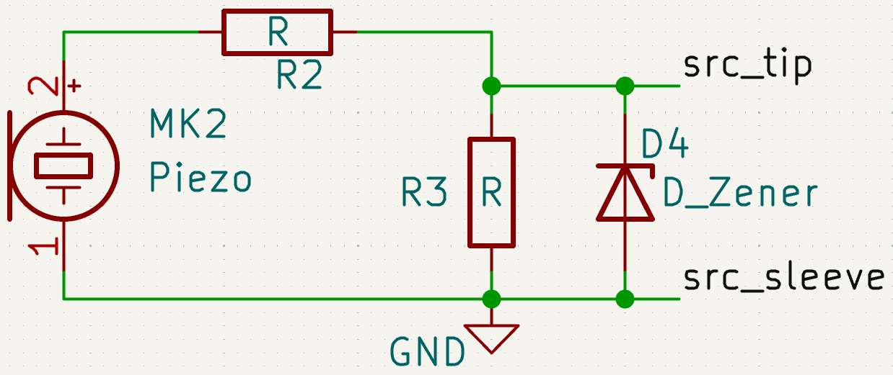
  

  

    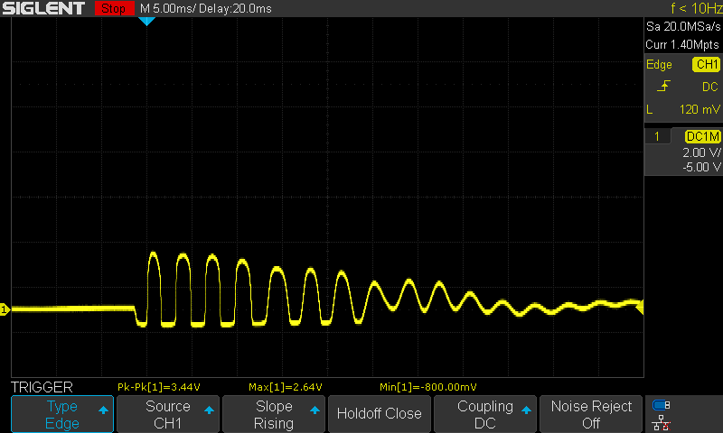
    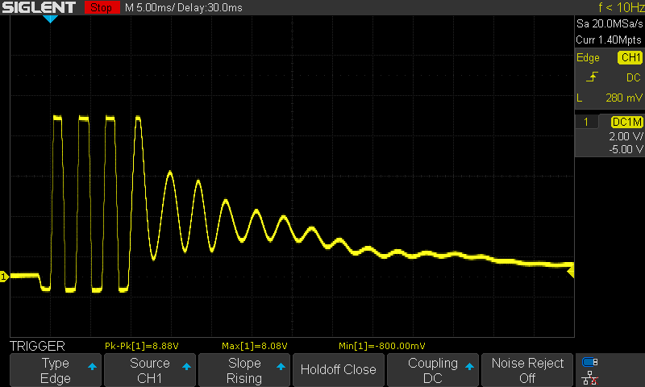
  

<!-- I also want to add an RC circuit to control how long the peaks can be read out.

The R and C form the RC circuit. The zener diode clips the positive part of the input signal to the zener voltage. The 'normal' diode makes sure voltage drop over the zener diode in the negative part of the input signal is blocked. Preventing negative inputs to the ADC of the microcontroller. The downside of this circuit is that the voltage to the ADC always has the voltage drop over D1. To prevent this, a [peak detector circuit](https://components101.com/articles/peak-detector-circuit-type-working-explanation-using-opamp) could be added.

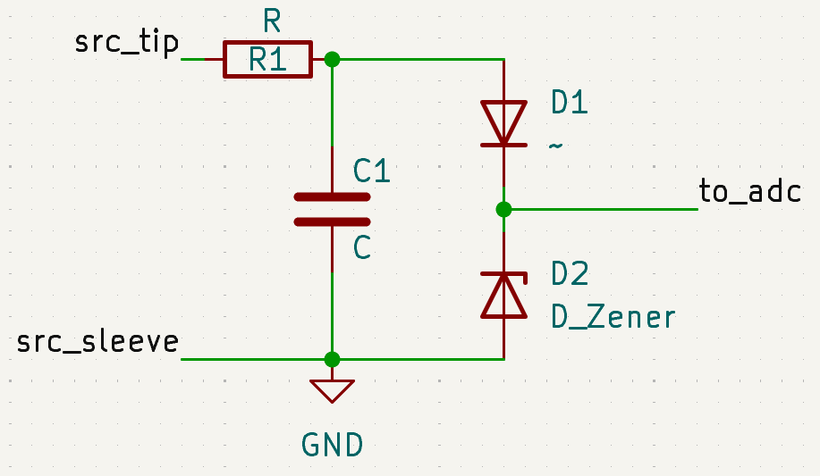 -->

### Piezo interface circuit

The circuit below will be used to feed the piezo signal into an ADC.

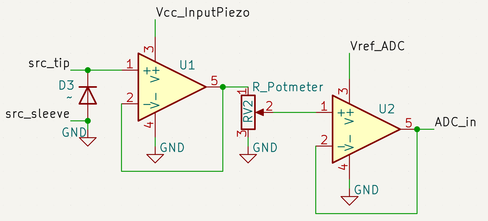

Going to left to right:

- The first diode in parallel with the piezo signal is to ignore the negative part of the piezo signal.
  - There is still the voltage drop from the diode.
- The first opamp is a voltage follower.
  - This makes sure that the high impedence piezo doesn't interfere with the circuit in the module.
  - Vcc should be at least as high as the maximum expected piezo signal. We don't want to clip the signal.
  - The output of the opamp is expected to be the same (follow) the input voltage.
- The potmeter is to scale the piezo voltage down.
  - It acts as a voltage divider.
  - The 'middle' pin is connected to the input for the second opamp.
- The purpose of the second opamp is to clip the voltage to a safe value for the ADC.

#### Measuring the output of the first opamp

In the screenshot below, the yellow line is the piezo signal. The blue line is the output of the first opamp.

The Vcc for the opamp is set to 20V. This results in the opamp output to be clipped to ~20V (19.2V in this case).

The negative piezo voltages results in a 0.6V voltage drop over the diode. The output of the opamp has -0.2V output at these points.

The image shows that the voltage follow does work to follow the input signal.

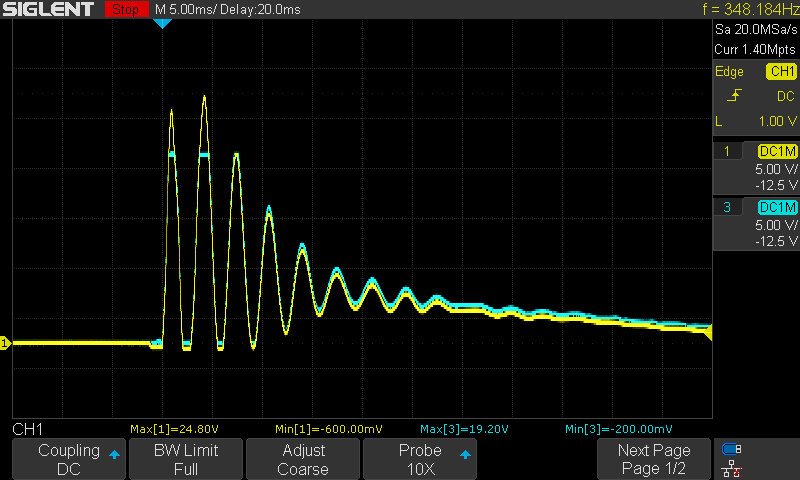

#### Measuring the output of the second opamp with the potmeter

For this section I increased Vcc to 30V to not clip the output of the first opamp. For this test the Vcc of both opamps where the same.

The two images below show different amount of rotation of the potentiometer. Blue is the output if the first opamp. Purple is the output of the second opamp.

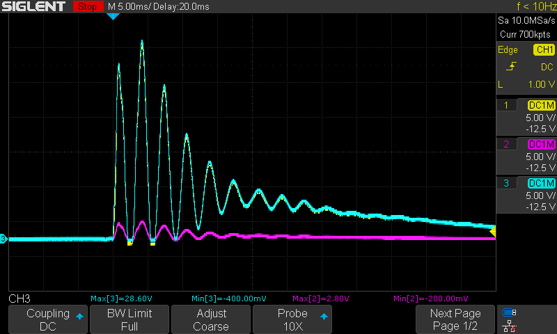

The second opamp is there to clip the output voltage to the maximum allowed input voltage of the ADC. In the images above a single Vcc was used. Later on I will try separate Vcc voltages to check the clipping of the opamp.
