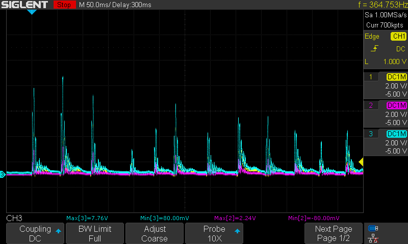
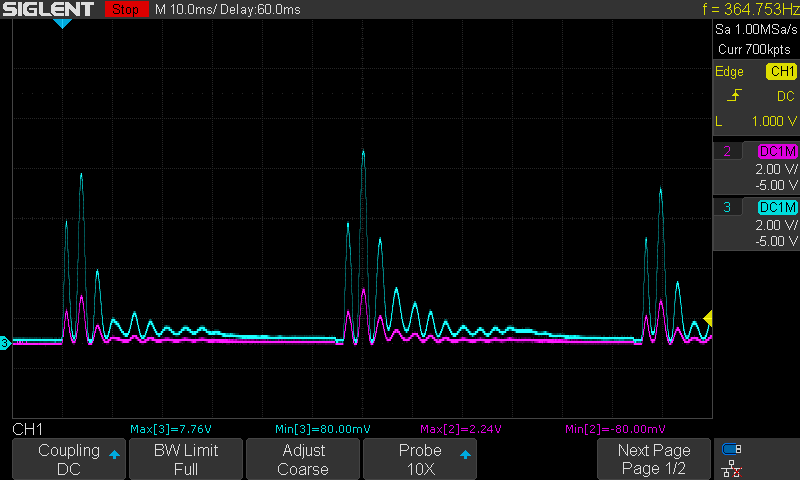
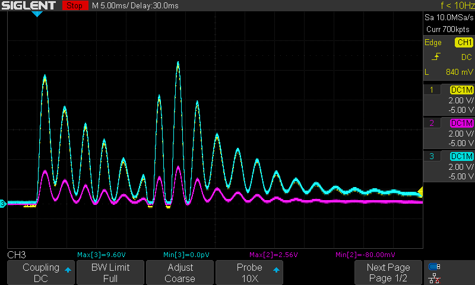
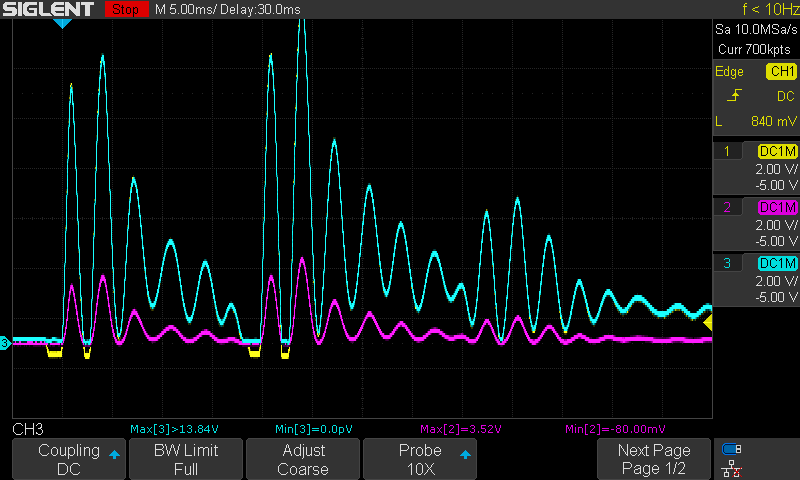
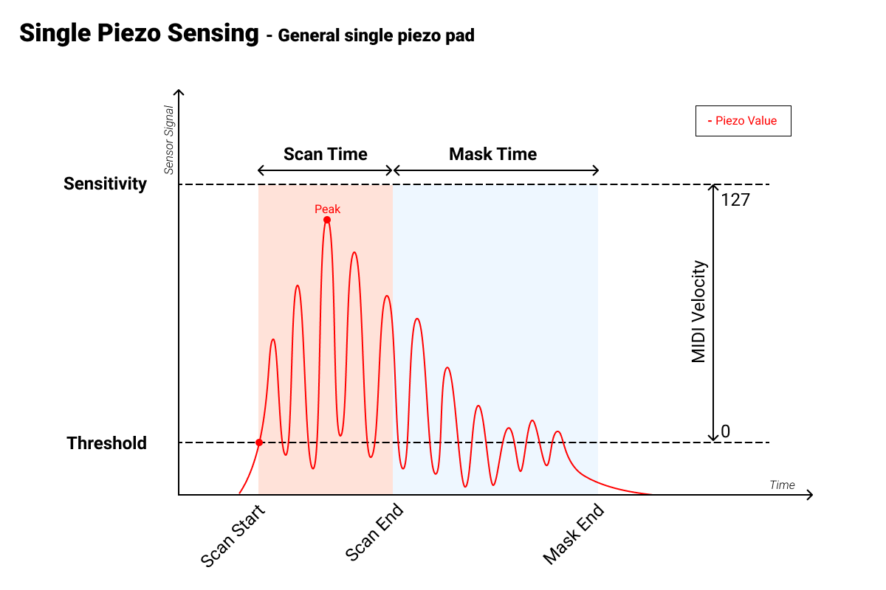
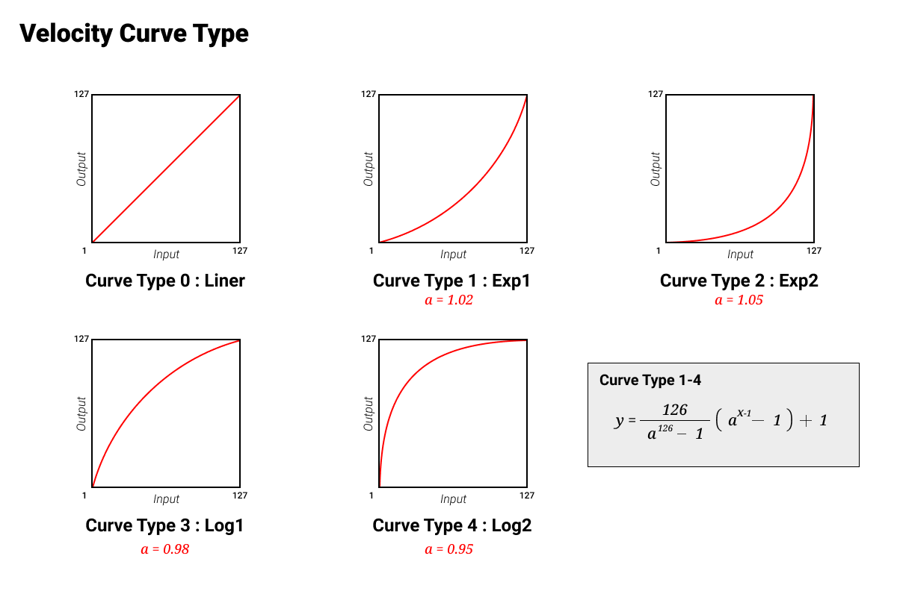

# Sofware design

## Considerations

- I don't want to be fixed to a single microcontroller (brand).
- Keep it simple. Calculate things like the minimum sampling frequency and see how to implement this as simple as possible.
- The first version should only: read analog value -> process this into a hit strength -> translate this to a midi note -> send the midi output.

## ADC

I think that I will be using an external ADC chip from which the analog values can be read with SPI/I2C for the first version. Not only does this prevent setting up any ADC for each microcontroller, it also allows to select a microcontrolle (or devboard) that doesn't have enough analog inputs (like the Arduino Uno).

### Minimum specs

A fast drum song is for example "Flying Whales" by "Gojira". The quarter notes are at 191 BPM. Meaning that each quarter note is (60,000 / 191) ~314 miliseconds (ms). The quickest notes are a triplet of 16th notes (double bass). 6 triplet 16th notes fit into a quarter note. Resulting in ((60.000 / 191) / 6) ~52 ms per note. For easier calculations and to give a git more headroom, I will round it down to **50 ms per note that should be able to be processed**.

When I played as quickly as possible as quickly as possible with two sticks on the Alesis pad I got the following signal. This signals shows intervals of 50ms as well. This is not the speed that (I) will be continuisly drumming at, but it gives an indicatino of my current speed.

> The blue line is the output of the first opamp. The purple line is the output of the second opamp after the voltage is divided using the potmeter. See the circuit in [PiezoInputCircuit.md](PiezoInputCircuit.md).

Sometimes you also want to add grace notes. A grace note in the scope looks like below. This shows that a grace note (played as fast as I can) is around 20ms before the main note. This is in line with the previously measured 50ms for quick playing. The grace often is played quicker.

And if you are not careful, you might add a third trigger which was not intended:

So lets cut the processing of a single note to **15 ms**.

One thing to keep in mind is that you often want to play multiple note per beat (or a fraction of a beat). Assuming you have two feet and two hands, up to 4 notes can be played at a time. But the software of course doesn't know what you want to play. Or if you are playing with two people on a single drum kit. So the software has to measure all the inputs (either by polling or by interrupts). Assuming a basic drum kit, the amount of inputs can easily reach 10 analog inputs.

The 'problem' however, is that a hard hit takes between 20 and 30 ms to start dying of. see the oscilloscope screenshots in [PiezoInputCircuit.md](PiezoInputCircuit.md). These plots also show that the frequency of the piezo voltage is ~400Hz (2.5ms). Sampling at ten times this frequency might be nice to start with. That would be 4KHz (0.25ms). After around the 6th cycle of the piezo voltage it starts dying out. That would be 60 samples. 6 cycles coincidentally is also the time between a grace note and the normal note.

It's not good to measure 60 samples at 4KHz for one input, and only then reading the next one. You will only be able to read one note per 15ms. Doing a round robin over each input would be better. But if that would stil be at 4KHz, then the sampling rate per input is reduced. So instead the sampling rate should be multiplied by the amount of inputs. Taking the 10 inputs again, that would result in a sampling rate of 40KHz. Resulting in an effective 4KHz sampling per input.

> Things found so far:
>
> - Maximum 15ms to process a hit
> - Round robin at a frequency of _4KHz * #inputs_

The different channels will of course not be always start nicely at the start of a 15ms period. The 15ms simply says to continuenaly measure an input, and when the software detects a hit, is starts to process the data for 15ms to process the hit. **There are several aspects to measuring an edrum hit which will be discussed later.**

### Reading the data

If an external ADC is used to read the values over a serial connection, then polling all inputs is required. To make it more efficient the ADCs of the microcontroller itself could be used. But that also adds more complexity and dependency. First the external ADC will be tested.

Assuming that the [MCP3008](https://cdn-shop.adafruit.com/datasheets/MCP3008.pdf) will be used (one that is available at my local store), SPI will be used for the communication. It is a 8-channel ADC which fits the assumed number of inputs for a basic drum kit.

It was a good decision to use to opamps for the piezo circuit. Because a lower input impedence allows fora larger sampling rate as is stated in the datasheet of the MCP3008. The application notes of the datasheet mentioned that many micricontrollers don't allow for sub-8-bit data transfers (input and output). Therefore each sampling conversion plus reading results in 24 clocks cycles (3 bytes to be written/read) + 1 cycles to acount for the reset of the chip select signal. The datasheet mentioned a maximum clock frequency of 3.6MHz when Vdd is 5V. This results in an effective sampling frequency of around (3.6MHz / 25) 144KHz (or 144K samples per second (sps)). If you are not contrained to the 8-bit reading/writing then you only need 17 + 1 clock cycles. which would result in (3.6MHz / 18) 200KHz (or 200Ksps). This is also the maximum speed that the datasheet mentions.

> If these rough calculations are correct in practice as well, then this ADC more than sufficient for sampling the 10 analog inputs of the drum kit. Since from the precious section it turns out that 40KHz would probably already be enough.

This ADC is 10 bits. At a Vref of 5V this gives a resolution of 5V / 2^10 = 5V / 1024 = ~0.0048V. This should be more than enough.

## Processing the read piezo signal

### Things to do with the signal

The open-e-drums project made a nice [explanation](https://github.com/RyoKosaka/HelloDrum-arduino-Library/blob/master/docs/sensing.md) of this. Also [this](https://edrums.github.io/en/roland/trigger_settings/) one.

I will be borrow the image from the open-e-drum documentation and show it here as well.

Besides the piezo signal we also need to measure the signal from the high-hat stand. But that is a different sensor (Force Sensitive Resistor (FSR)) and will be discussed later.

Once the raw velocity is measured, this velocity can be mapped on a curve to adjust the dynamics/sensitivity. For this I again borrow an image from the open-e-drum documentation.

Other things to consider are handling pads with two or more sensors. For example, one for the pad and one for the rim, or for a ride where you have a bell, bow and edge/grip sensor. These will not be taken into account for the first version.

[This](https://edrums.github.io/en/roland/trigger_settings/) page also talks about cross talk elimination. While this may be useful, I will not do this for the first version.

### The flow from reading the ADC to processing the read value

## MIDI

