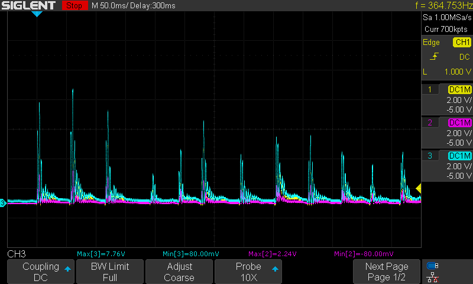
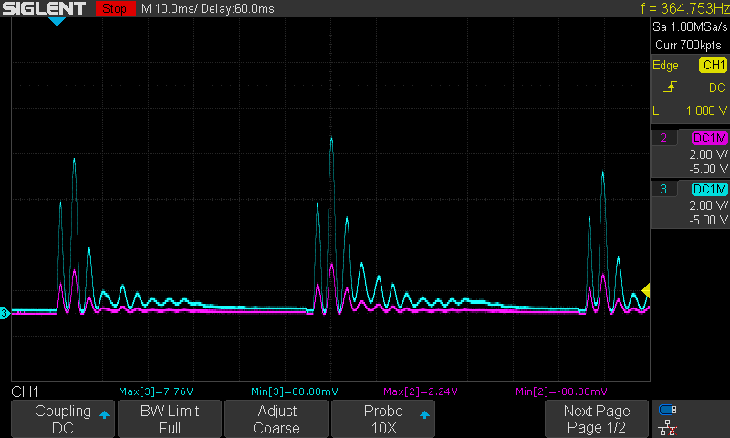
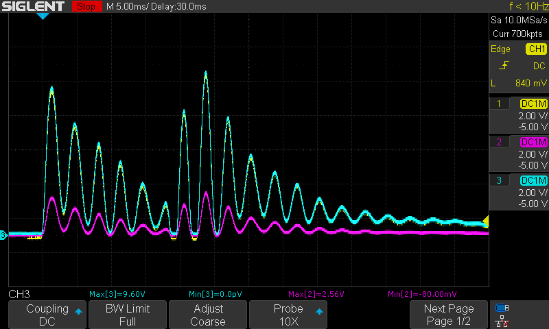
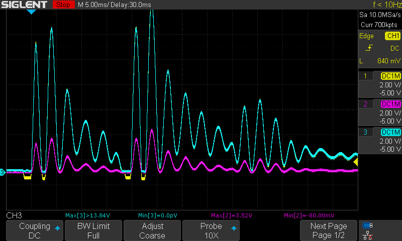
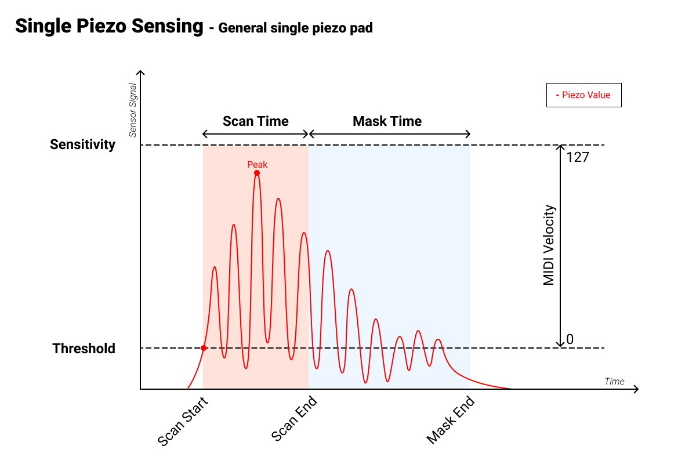
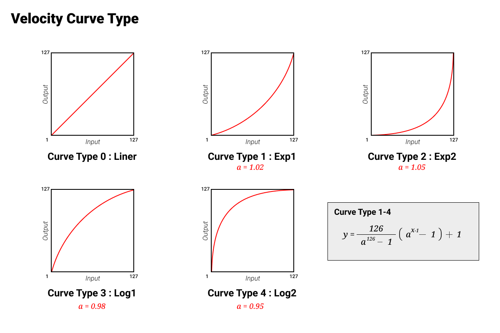
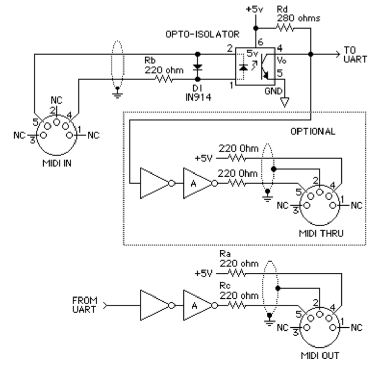
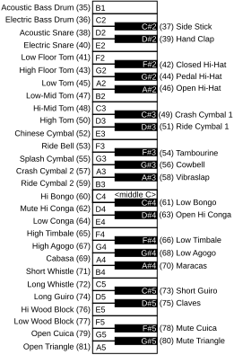
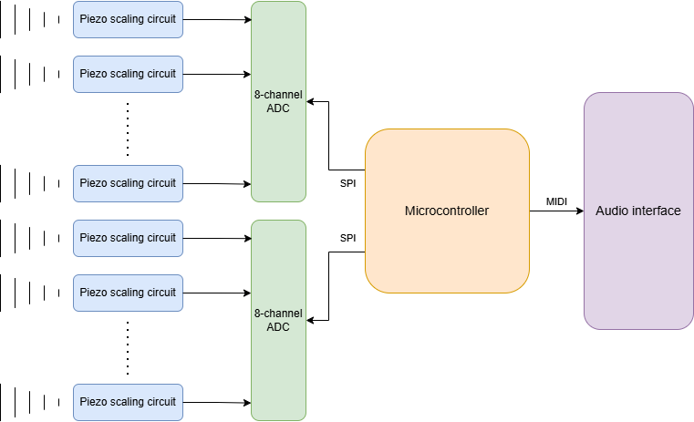
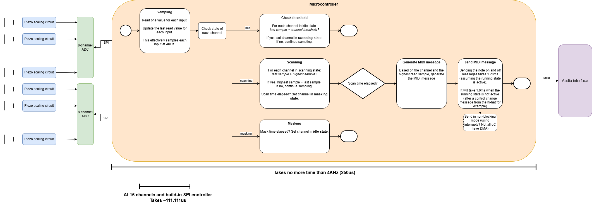

# Sofware design

What should the software do:

- Read the analog piezo signals
- Calculate how hard the piezo was hit
- Send MIDI messages

## ADC

I think that I will be using an external ADC chip from which the analog values can be read with SPI/I2C for the first version. Not only does this prevent setting up any ADC for each microcontroller, it also allows to select a microcontrolle (or devboard) that doesn't have enough analog inputs (like the Arduino Uno).

### Fastest notes to be played

A fast drum song is for example "Flying Whales" by "Gojira". The quarter notes are at 191 BPM. Meaning that each quarter note is (60,000ms / 191BPM) ~314ms. The quickest notes are a triplet of 16th notes (double bass). 6 triplet 16th notes fit into a quarter note. Resulting in ((60.000 / 191) / 6) ~52ms per note. For easier calculations and to give a bit more headroom, I will round it down to **50 ms per note that should be able to be processed**.

When I played as quickly as possible with two sticks on the Alesis pad I got the following signal. This signal shows intervals of 50ms as well.

> The blue line is the output of the first opamp. The purple line is the output of the second opamp after the voltage is scaled down using the potmeter. See the circuit in [PiezoInputCircuit.md](PiezoInputCircuit.md).




Sometimes you also want to add grace notes. A grace note in the scope looks like below. This shows that a grace note (played as fast as I can) is around 20ms before the main note.



So lets cut the processing of a single note to **15 ms**.

### Unintentional triggers

If you are not careful, you might add a third trigger which was not intended (see third trigger below). This may need to be handled in software by playing around with the thresholds.



### Reading multiple ananlog inputs

One thing to keep in mind is that you often want to play multiple note per beat. Assuming you have two feet and two hands, up to 4 notes can be played at a time. But the software of course doesn't know what you want to play. Or if you are playing with two people on a single drum kit. So the software has to measure all the inputs (either by polling or by interrupts). Assuming a basic drum kit, the amount of inputs can easily reach 10 analog inputs.

The 'problem' however, is that a hard hit takes between 20 and 30 ms to start dying of. see the oscilloscope screenshots above and in [PiezoInputCircuit.md](PiezoInputCircuit.md). These plots also show that the frequency of the piezo voltage is **~400Hz (2.5ms period)**. Sampling an input at ten times this frequency might be nice to start with. That would be 4KHz (0.25ms). After around the 6th cycle of the piezo voltage it starts dying out. That would be 60 samples. 6 cycles coincidentally is also the time between a grace note and the main note.

It's not good to measure 60 samples at 4KHz for one input, and only then start reading the next one. You will only be able to read one note per 15ms. Doing a round robin over each input would be better. But if that would stil be at 4KHz, then the sampling rate per input is reduced. So instead, the sampling rate should be multiplied by the amount of inputs. Taking the 10 inputs again, that would result in a sampling rate of 40KHz. Resulting in an effective 4KHz sampling per input. If you now read one sample of each input in a round-robin fashion at 40KHz, you end up at reading in input at a frequency of 4KHz.

> Things found so far:
>
> - Maximum 15ms to process a hit
> - Round robin at a frequency of _4KHz * #inputs_

The different channels will of course not be always start nicely at the start of a 15ms period. The 15ms simply says to continuenaly measure an input, and when the software detects a hit, it starts to process the data for up to a maximum of 15ms. There are several aspects to measuring an edrum hit which will be discussed later.

### Reading the data

If an external ADC is used to read the values over a serial connection, then polling all inputs is required. To make it more efficient, the ADCs of the microcontroller itself could be used. But that also adds more complexity and dependency. First the external ADC will be tested.

Assuming that the [MCP3008](./Datasheets/MCP3008.pdf) will be used (one that is available at my local store), SPI will be used for the communication. It is a 8-channel ADC.

It was a good decision to use to opamps for the piezo circuit. Because a lower input impedence allows for a larger sampling rate as is stated in the datasheet of the MCP3008. The application notes of the datasheet mentioned that many microcontrollers don't allow for sub-8-bit data transfers (input and output). Therefore each sampling conversion plus reading results in 24 clocks cycles (3 bytes to be written/read) + 1 cycle to acount for the reset of the chip select signal. The datasheet mentioned a maximum clock frequency of 3.6MHz when Vdd is 5V. This results in an effective sampling frequency of around (3.6MHz / 25) **144KHz** (or 144K samples per second (sps)). This is ~6.94us per sample. If you are not constrained to the 8-bit reading/writing then you only need 17 + 1 clock cycles. which would result in (3.6MHz / 18) 200KHz (or 200Ksps). This is 5us per sample. This is also the maximum speed that the datasheet mentions.

> If these values are correct in practice as well, then this ADC is more than sufficient for sampling the 10 analog inputs of the drum kit. Since from the precious section it turns out that 40KHz would probably already be enough.

This ADC is 10 bits. At a Vref of 5V this gives a resolution of 5V / 2^10 = 5V / 1024 = ~0.0048V. This should be more than enough.

## Processing the read piezo signal

### Things to do with the signal

The open-e-drums project made a nice [explanation](https://github.com/RyoKosaka/HelloDrum-arduino-Library/blob/master/docs/sensing.md) of this. Also [this](https://edrums.github.io/en/roland/trigger_settings/) one.

I will borrow the image from the open-e-drum documentation and show it here as well.



Besides the piezo signal we also need to measure the signal from the high-hat stand. But that is a different sensor (Force Sensitive Resistor (FSR)) and will be discussed later.

Once the raw velocity is measured, this velocity can be mapped on a curve to adjust the dynamics/sensitivity. For this I again borrow an image from the open-e-drum documentation.



Other things to consider are handling pads with two or more sensors. For example, one for the pad and one for the rim, or for a ride where you have a bell, bow and edge/grip sensor. These will not be taken into account for the first version.

[This](https://edrums.github.io/en/roland/trigger_settings/) page also talks about cross talk elimination. While this may be useful, I will not do this for the first version.

## MIDI

<!-- https://www.philrees.co.uk/articles/midimode.htm -->

### Hardware

Below is an image taken from the [MIDI 1.0 specification](./Datasheets/M1_v4-2-1_MIDI_1-0_Detailed_Specification_96-1-4.pdf). For the purposes of this project, only the `MIDI OUT` circuit is relevant. The `MIDI IN` is assumed to already be present on your audio interface.



### Protocol

MIDI works at the following specifications (see [MIDI 1.0 specification](./Datasheets/M1_v4-2-1_MIDI_1-0_Detailed_Specification_96-1-4.pdf)):
- 31.25 Kbaud
- Asynchronous (no clock)
- Start and stop bit
    - Start bit: local 0
    - Stop bit: local 1
- 8 data bits

In MIDI each signal change only contains one bit of information. Meaning that each bit takes 32 us. Resulting in each 10 bits to taking 320 us.

### Channel messages

MIDI messages are sent over any of the available 16 channels.

A channel message consists of a status byte an optionally data bytes (depending on the status to send).

The status byte uses the 4 Least Significant Bits (LSBs) to indicate the channel to send it to, and the 4 Most Significant Bits (MSBs) bits to indicate the message.

Of this status byte the MSB is set to 1 to indicate that it's a status byte. This leaves room for 7 statusses (3 bits)  to be sent.

Data bytes are indicated by setting the MSB to 0. This leaves 7 bits for the data.

```
0b1.sss....cccc   [0b0ddddddd] [0b0ddddddd]
   /   \  /    \  |
   Status channel | Depends on status
```

This YouTube [video](https://www.youtube.com/watch?v=2BccxWkUgaU) from Simon Hutchinson explains it clearly as well.

### Message to be used by the module

The module to be created in this project will mainly be sending `Note-On` (`001`) and `Control Change` (`011`) (for the hi-hat pedal) voice messages.

Page 9 of the standard mentions that a `Note-On` message takes 3 bytes (1 status byte and 2 data bytes (note and velocity) = 30 bits) which would mean 960us. So multiple notes at the same time might have some audible delay.

To reduce the time per note, the Running Status can be used. MIDI stays in last status that was sent until a new status is sent. Meaning that if the Note-On status is set, you can send multiple pairs of data bytes to save a byte (the status byte) on each note.

This [video](https://www.youtube.com/watch?v=JXfrqjkVcKg) from "The eDrum Workshop" shows that notes are mainly 'turned off' (a velocity of 0) right after sending them. But some modules allow to set an 'on' time. Nevertheless, a hit on the drum needs to be turned on and off. Assuming the running status is used, this requies 1 status byte to start the running note and 4 data bytes to turn on and off the note.

> Assuming that the status byte is already sent, one note requires 4 data bytes (40 bits) which results in 4 * 320us = 1.28ms

In the previous section about the ADC it was seen that (my) fastest playing would require a maximum of 15ms of processing per note. Reducing this by 1.28ms to send the MIDI message leaves **13.72ms** to process a hit from the point of hitting the drum.

### MIDI note mapping for drums

The image below (from [wikipedia](https://en.wikipedia.org/wiki/General_MIDI#Percussion)) shows a general mapping. But every brand of electric drum may be using a different mapping. Some also allow you to change to MIDI note that is sent for a certain input.

Most drum modules send MIDI messages on **channel 10**.



## System overview

### Microcontroller

The first image below is a very high level system overview. Two ICs will be used, each with 8-channels.



The second image shows the algorithm on the microcontroller in a bit more detail.

It shows that each channel will have a state machine (corresponding to the reading windows shown earlier).

Sending the MIDI on&off messages for a single hit (assuming runing status) takes 1.28ms. If the sending of this data would be blocking (simplest implementation), at an effective sampling rate of 4KHz per input, this would result in missing 6 samples per input. Looking at the scope plots from earlier this is around 10% of the expected scanning window. If this is an issue has to be seen in practice after is has been built.



Preferably the uart is not blocking. This can be implemented with either interrupts or by usind DMA. DMA has the least impact on the CPU. But not all microcontrollers have DMA. Another method is to use interrupts. This means that you are sending one byte at a time. But instead of waiting for each byte to be sent and then sending the next byte, you send a byte, do something else, and when the bytes is sent (or more specifically, taken out of the UDR register), an interrupt will be triggered to start the sending of the next byte.

This also results in the question, should sample count or time delta be used to determine the scanning/masking windows duration. I think that time delta would be more suitable. Maybe since the analog input is time sensitive. If the sampling gets delayed for some reason, if sample count is used, then the last sample is lower than expected. If time delta is used, you may read less data points, but the last sample is still withing the window where the read data is of interest.

Assuming that the standard SPI peripheral is used, and that whole bytes have to be written/read (worst case), the ADC can be read ad 144KHz / 6.944... us (see earlier section). When all inputs are connected, this means it will take (144KHz / 16 = 9KHz) 111.111... us to read all 16 inputs. This leaves (250 - 111.111...) = ~138.889 us for processing the read samples

### Configuration

To control the scan and masking time, the velocity curves, the MIDI note to send for a certain input, etc. some sort of interface is needed.

This could be done with buttons and a small character-LCD screen, but that wouldn't be very intuitive to use.

Instead using a Raspberry Pi (RPI) with a small (touch) screen would be more intuitive.

Any updates to the configuration done in the RPI would be send over UART to the microcontroller.

When the RPI sends a message, an interrupt on the microcontroller should be fired and the change should be applied.

The configuraiton options **per input** known so far are:

| Setting | Range | Unit |
|---      |---    |---   |
| Threshold | 0 - 127 | Integer |
| Scan time | >= 0 | Milliseconds with 2 decimals precision |
| Mask time | >= 0 | Milliseconds with 2 decimals precision |
| Velocity curve ID | >= 0 | Integer |
| Mapped MIDI note | 0 - 127 | Integer |
